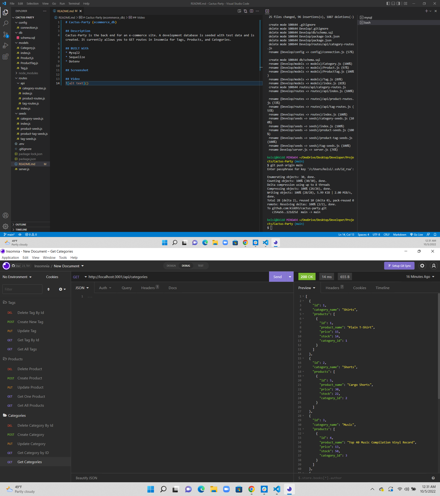

# Cactus-Party (ecommerce_db)

## Description
Cactus-Party is the back end for an e-commerce site. A development database is seeded with test data and is created. It currently allows you to GET routes in Insomnia for Tags, Products, and Categories.

## BUILT With 
* Mysql2
* Sequelize
* Dotenv

## Screenshot

## Video 
https://drive.google.com/file/d/1eRliQmA3bsqWR45cxO402VJwFD8fCRFG/view